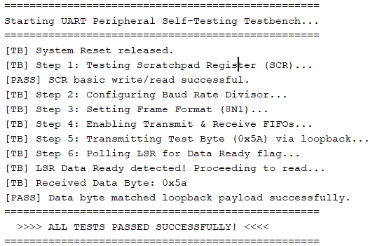
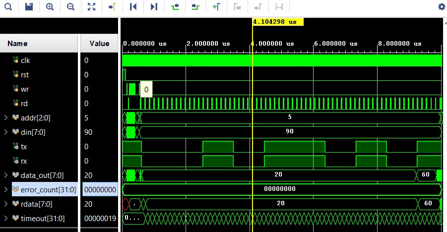
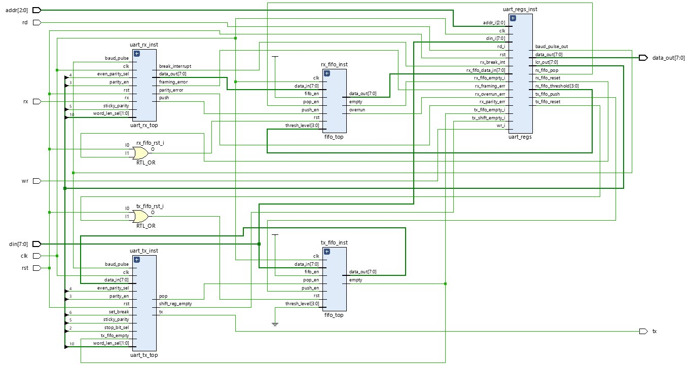
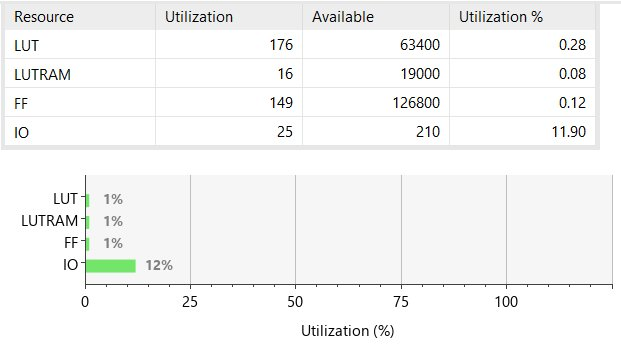
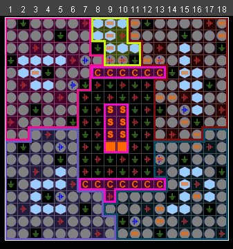

# Advanced UART Peripheral — Verilog RTL

A fully functional, **16550-compatible UART peripheral** implemented from scratch in synthesisable Verilog RTL, verified in simulation with a self-checking loopback testbench, and successfully implemented on a **Digilent Arty A7-100T** FPGA (Xilinx Artix-7 XC7A100T).

---

## Table of Contents

- [Overview](#overview)
- [Features](#features)
- [RTL Design](#rtl-design)
- [Testbench & Simulation](#testbench--simulation)
- [Generated Schematic](#generated-schematic)
- [FPGA Implementation Results](#fpga-implementation-results)

---

## Overview

This project implements a UART (Universal Asynchronous Receiver/Transmitter) peripheral in synthesisable Verilog, following the **NS16550A register model**. It supports configurable word length, parity, and stop bits, and features independent 16-entry deep TX and RX FIFOs. The design has been verified in simulation via a self-testing loopback testbench and is ready for FPGA implementation on the Arty A7-100T.

---

## Features

| Feature | Detail |
|---|---|
| **Word Length** | 5, 6, 7, or 8 data bits (selectable via LCR) |
| **Stop Bits** | 1 or 2 stop bits (1.5 for 5-bit word) |
| **Parity** | None, Odd, Even, Sticky-1, Sticky-0 |
| **Baud Rate** | Fully programmable via 16-bit divisor (DLL/DLM) |
| **TX FIFO** | 16 × 8-bit synchronous FIFO with overrun detection |
| **RX FIFO** | 16 × 8-bit synchronous FIFO with programmable threshold (1/4/8/14 bytes) |
| **Error Detection** | Framing error, Parity error, Overrun error, Break interrupt |
| **Break Control** | Transmitter can force a break condition (line LOW) |
| **FIFO Reset** | Independent soft-reset for TX and RX FIFOs via FCR |
| **LSR** | Line Status Register with sticky error flags, cleared on read |
| **SCR** | Scratch register for software use |
| **RX Synchroniser** | Two-stage flip-flop metastability protection on RX input |
| **Loopback Testbench** | Self-checking TX→RX loopback with timeout detection |
| **FPGA Ready** | Xilinx XDC constraints included for Arty A7-100T |

---

## RTL Design

The peripheral is structured as five independent, synthesisable Verilog modules. Every module was written by hand — no vendor IP was used.

```
uart_top.v          ← top-level integration
├── uart_regs.v     ← 16550-compatible register file
├── uart_tx_top.v   ← transmit engine
├── uart_rx_top.v   ← receive engine
└── fifo_top.v      ← generic 16×8 synchronous FIFO (instantiated twice)
```

---

### `uart_top` — Top-Level Integration

`uart_top` is the integration shell. It instantiates all five sub-modules, routes the shared `baud_pulse` between the register block and the TX/RX engines, and implements combined hard+soft FIFO resets by OR-ing the active-high `rst` with the self-clearing FCR reset pulses (`rst | fcr_tx_reset` and `rst | fcr_rx_reset`).

**Ports:**

| Port | Dir | Width | Description |
|------|-----|-------|-------------|
| `clk`      | In  | 1 | System clock |
| `rst`      | In  | 1 | Active-high reset |
| `wr`       | In  | 1 | Write strobe — one clock pulse to write `din` to register at `addr` |
| `rd`       | In  | 1 | Read strobe — one clock pulse to read register at `addr` |
| `addr`     | In  | 3 | Register address (0–7) |
| `din`      | In  | 8 | Write data bus |
| `data_out` | Out | 8 | Read data bus (combinatorial, valid while `rd` is high) |
| `tx`       | Out | 1 | UART serial transmit line (idles HIGH) |
| `rx`       | In  | 1 | UART serial receive line (idles HIGH) |

---

### `uart_regs` — Register File

`uart_regs` implements the **16550-compatible register map** and contains the programmable baud rate generator.

**Registers implemented:**

| Addr | DLAB | Name | R/W | Description |
|------|------|------|-----|-------------|
| 0x0  | 0    | THR / RBR | W / R | Transmit Holding / Receive Buffer — write pushes to TX FIFO, read pops from RX FIFO |
| 0x0  | 1    | DLL  | R/W | Baud Rate Divisor LSB |
| 0x1  | 1    | DLM  | R/W | Baud Rate Divisor MSB |
| 0x2  | —    | FCR  | W   | FIFO Control Register |
| 0x3  | —    | LCR  | R/W | Line Control Register |
| 0x5  | —    | LSR  | R   | Line Status Register |
| 0x7  | —    | SCR  | R/W | Scratch Register |


**Baud Rate Generator** — a 16-bit down-counter clocked at `F_clk`. It reloads from `{DLM, DLL}` each time it reaches zero and emits a single-cycle `baud_pulse`. Every bit period in the TX/RX engines is exactly 16 `baud_pulse` ticks, giving 16× oversampling.

```
Divisor = F_clk / (16 × Baud_Rate)
```

| Baud Rate | Divisor | DLM | DLL |
|-----------|---------|-----|-----|
| 9600      | 0x0271  | 0x02 | 0x71 |
| 115200    | 0x0022  | 0x00 | 0x22 |

**LCR — Line Control Register (addr 0x3):**

| Bit | Field | Description |
|-----|-------|-------------|
| 7   | DLAB  | Set 1 to access DLL/DLM; clear to access THR/RBR |
| 6   | BC    | Break Control — forces TX line permanently LOW |
| 5   | SP    | Stick Parity — forces parity bit to a fixed level |
| 4   | EPS   | Even Parity Select — 1 = even, 0 = odd |
| 3   | PEN   | Parity Enable |
| 2   | STB   | Stop Bits — 0 = 1 stop bit, 1 = 2 stop bits |
| 1:0 | WLS   | Word Length — `00`=5-bit, `01`=6-bit, `10`=7-bit, `11`=8-bit |

**LSR — Line Status Register (addr 0x5):**

| Bit | Field | Description |
|-----|-------|-------------|
| 7   | RFFE  | RX FIFO contains a parity, framing, or break error |
| 6   | TEMT  | Transmitter Empty — TX shift register is idle |
| 5   | THRE  | TX Holding Register Empty — TX FIFO is empty |
| 4   | BI    | Break Interrupt |
| 3   | FE    | Framing Error |
| 2   | PE    | Parity Error |
| 1   | OE    | Overrun Error |
| 0   | DR    | Data Ready — at least one byte in RX FIFO |

Error flags (bits 4–1) are **sticky**: they set on the incoming error and only clear when the LSR is read, matching 16550 behaviour and preventing missed errors on fast data streams.

**FCR — FIFO Control Register (addr 0x2, write-only):**

| Bit | Field  | Description |
|-----|--------|-------------|
| 7:6 | RXTL   | RX Trigger Level — `00`=1, `01`=4, `10`=8, `11`=14 bytes |
| 3   | DMA    | DMA Mode Select |
| 2   | TXRST  | TX FIFO Soft Reset (self-clearing one-cycle pulse) |
| 1   | RXRST  | RX FIFO Soft Reset (self-clearing one-cycle pulse) |
| 0   | FEN    | FIFO Enable |

---

### `uart_tx_top` — Transmit Engine

`uart_tx_top` is a **4-state FSM** that serialises bytes from the TX FIFO onto the `tx` line. Every state transition is gated on `baud_pulse`, so each symbol lasts exactly 16 baud ticks regardless of the system clock frequency.

```
ST_IDLE ──► ST_START ──► ST_DATA ──► ST_PAR ──► (back to ST_IDLE)
 (wait)      (start bit)  (data bits)  (parity)
```

- **ST_IDLE** — monitors `tx_fifo_empty`. When data is available and the stop-bit guard counter has expired, it latches the data word into `shift_reg`, asserts `pop` for one clock to dequeue from the TX FIFO, drives `tx` low (start bit), and advances.
- **ST_START** — holds the start bit for 16 baud ticks. Simultaneously pre-computes `data_parity` (XOR of the active data bits) so it is ready before the data phase ends.
- **ST_DATA** — shifts out bits LSB-first one per 16 baud ticks. `bit_counter` is initialised to `{1'b1, word_len_sel}` (value 3/4/5/6) covering all four word lengths. On the last bit, the final parity bit is computed and the FSM branches to ST_PAR or directly to idle.
- **ST_PAR** — transmits the parity bit for 16 baud ticks, then loads the stop-bit hold counter and returns to ST_IDLE.

Stop-bit duration follows the 16550 spec exactly: 16 ticks for 1 stop bit; 24 ticks (1.5 bits) for 2-stop with 5-bit word; 32 ticks (2 full bits) for all other word lengths. The `tx` output register applies `set_break` (LCR[6]) to force the line LOW regardless of the shift register state.

---

### `uart_rx_top` — Receive Engine

`uart_rx_top` is a **5-state FSM** that recovers bytes from the `rx` line using 16× oversampling. Every bit is sampled at its mid-point (8 baud ticks after the leading edge) to maximise noise margin.

```
ST_IDLE ──► ST_START ──► ST_DATA ──► ST_PAR ──► ST_STOP
 (detect)    (verify)    (shift in)  (check)    (push & error flags)
```

The `rx` input first passes through a **two-stage flip-flop synchroniser** (`rx_sync1 → rx_sync`) before the FSM sees it, eliminating metastability from asynchronous external signals.

- **ST_IDLE** — detects `~rx_sync` (line goes low = start condition). Sets `baud_counter = 7` to land at the mid-point of the start bit after 8 ticks.
- **ST_START** — waits 8 ticks then samples `rx_sync`. Low confirms a valid start bit; high is a false glitch and the FSM returns to idle without recording anything.
- **ST_DATA** — samples `rx_sync` every 16 ticks at mid-bit. Each sample is shifted into `data_out` with the upper bits zeroed according to `word_len_sel`, so the assembled byte is always right-aligned. When `bit_counter` reaches zero all data bits have been collected.
- **ST_PAR** — samples the parity bit, masks `data_out` to the active word length, recomputes the expected parity value, and sets `parity_error` if they do not match.
- **ST_STOP** — samples the stop bit. `framing_error` is set if `rx_sync` is low (missing stop). `break_interrupt` is set if the stop bit is missing and all data bits were zero. `push` is asserted for one clock to write `data_out` into the RX FIFO, then returns to idle.

---

### `fifo_top` — Synchronous FIFO

`fifo_top` is a generic **16-entry × 8-bit** synchronous FIFO shared between both data paths. It uses a `reg [7:0] mem [0:15]` storage array with 4-bit circular `wptr` and `rptr` pointers and a 5-bit `count` register to cleanly distinguish full from empty without grey-code logic.

**Flags:**

| Signal | Description |
|--------|-------------|
| `empty`         | Asserted when `count == 0` |
| `full`          | Asserted when `count == 16` |
| `overrun`       | Push attempted while full (registered) |
| `underrun`      | Pop attempted while empty (registered) |
| `thresh_reached`| `count >= thresh_level`, evaluated every clock cycle |

`push` and `pop` are internally gated by `~full` and `~empty` respectively, so the count and pointers only advance on valid operations. `data_out` returns `8'h00` when empty to avoid X-propagation in simulation.

---

## Testbench & Simulation

### Testbench Design — `tb_uart_top`

The testbench wire-connects `tx` back to `rx` (`assign rx = tx`), creating a hardware loopback so every byte serialised by the TX engine travels through the full UART frame format and is deserialised by the RX engine.

Two reusable tasks abstract the register bus interface:

```verilog
// Asserts wr for exactly one clock cycle
task write_reg(input [2:0] r_addr, input [7:0] r_data);

// Asserts rd for exactly one clock cycle and captures data_out
task read_reg(input [2:0] r_addr, output [7:0] r_data);
```

**Test Sequence:**

| Step | Action | What It Verifies |
|------|--------|-----------------|
| 1 | Write `0xA5` → SCR, read back | Register file write/read path works |
| 2 | Set DLAB=1, write DLL=`0x02`, DLM=`0x00` | Baud divisor loads; `baud_pulse` generator is active |
| 3 | Write LCR=`0x03` (DLAB=0, 8 data bits, no parity, 1 stop bit) | LCR parses frame format fields; DLAB clears divisor access |
| 4 | Write FCR=`0x01` (enable FIFOs) | FCR activates TX and RX FIFOs |
| 5 | Write `0x5A` → THR | Byte enters TX FIFO; TX FSM begins serialising the 8N1 frame |
| 6 | Poll LSR bit 0 (DR) with 5000-iteration timeout | Full TX→serialise→loopback→deserialise→RX FIFO chain is exercised |
| 7 | Read RBR, compare to `0x5A` | RX FIFO pop, `data_out` bus, and register read-back are all correct |

`error_count` accumulates any mismatch or timeout. A final `$display` prints either `ALL TESTS PASSED` or the number of failures.
A pass/fail summary is printed to the console at the end.



### Simulation Result

The simulation was run in **Vivado xsim** at a 50 MHz system clock (`#10` half-period) with a baud divisor of 2, giving one `baud_pulse` every 40 ns and a complete 8N1 frame (1 start + 8 data + 1 stop = 10 bits × 16 ticks) in approximately 6.4 µs.



**What the waveform shows:**

- The `tx` / `rx` lines carry identical UART frames. The start bit (low), eight data bits of `0x5A` (`01011010`) LSB-first, and the stop bit (high) are clearly visible as the repeated pulse pattern between 0 and 8 µs
- `data_out` reads `0x20` during LSR polls (bits 5 and 6 high = TX FIFO empty and transmitter empty, all error flags clear), then returns `0x5A` on the final RBR read
- `rdata` correctly captures `0x20` from the LSR poll and `0x5A` from the payload read
- `error_count` stays at `0x00000000` for the entire simulation — **all test cases passed**
- `timeout` reaches only 19 before the Data Ready flag is set, far within the 5000-iteration guard, confirming the loopback completes in well under the allocated timeout window

---

## Generated Schematic

The RTL schematic below was produced by Vivado synthesis. It shows the five sub-modules and all interconnecting nets as inferred directly from the Verilog source.



**Reading the schematic:**

- **`uart_regs_inst`** (top right) is the central hub — it receives the host bus (`addr`, `wr`, `rd`, `din`) and fans out `lcr_out[7:0]`, `baud_pulse_out`, TX/RX push/pop strobes, and the RX FIFO threshold to all other blocks
- **`uart_rx_inst`** (top left) receives the synchronised `rx` input and the baud pulse. Its `data_out[7:0]` bus feeds directly into `rx_fifo_inst.data_in[7:0]` — the previously missing connection, now correctly wired
- **`uart_tx_inst`** (bottom left) reads `data_out[7:0]` from `tx_fifo_inst` and drives the top-level `tx` port. Its `pop` output feeds back to `tx_fifo_inst.pop_en`
- **`rx_fifo_inst`** and **`tx_fifo_inst`** (centre) are both instances of `fifo_top`. The two `RTL_OR` gates visible on their reset inputs implement the combined hard+soft reset (`rst | fcr_rx_reset` and `rst | fcr_tx_reset`) from `uart_top`
- All LCR configuration bits (word length `[1:0]`, parity enable `[3]`, even parity `[4]`, sticky parity `[5]`, break `[6]`) are routed from `uart_regs_inst.lcr_out[7:0]` to both `uart_tx_inst` and `uart_rx_inst` as individual bit-select wires, clearly visible as the fan-out bus in the centre of the schematic

---

## FPGA Implementation Results

### Resource Utilization

| Resource | Used | Available | Utilization |
|----------|------|-----------|-------------|
| LUT      | 176  | 63,400    | 0.28% |
| LUTRAM   | 16   | 19,000    | 0.08% |
| FF       | 149  | 126,800   | 0.12% |
| IO       | 25   | 210       | 11.90% |



### Timing Summary

All user-specified timing constraints are met with finite positive slack on both setup and hold paths — zero failing endpoints out of 583 analysed.

### Device Floorplan



---

## Target Hardware

| Item | Detail |
|------|--------|
| **Board**  | Digilent Arty A7-100T |
| **FPGA**   | Xilinx Artix-7 XC7A100T-CSG324-1 |
| **Clock**  | 100 MHz onboard oscillator |
| **TX / RX**| Connected to onboard FT2232HQ USB-UART bridge |
| **Tool**   | Xilinx Vivado |

---

